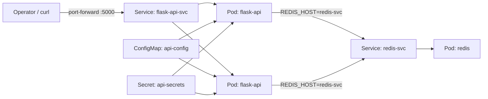

# k8s Multiservice Lab

A production-style Kubernetes lab that deploys a Flask API backed by Redis on a
real k3s cluster. The repo includes the application code, container build,
Kustomize manifests, namespace controls, network policies, autoscaling, CI
validation, and operator scripts.

This is intentionally small, but it is shaped like a real service repo: the app
has health/readiness endpoints, the manifests are reusable, the staging overlay
is declarative, and every important workflow is runnable from `make`.

## Architecture



## What It Demonstrates

- Multi-service Kubernetes deployment with API and cache services.
- k3s bootstrap flow for Codespaces-style Linux environments.
- Local image build and import into k3s containerd.
- Kustomize base plus staging overlay.
- ConfigMap and generated Secret injection.
- Liveness and readiness probes.
- Rolling updates with zero unavailable API replicas.
- Redis-backed request counter.
- Pod Security admission labels, non-root containers, dropped capabilities, and
  runtime default seccomp.
- Default-deny NetworkPolicies with explicit API-to-Redis traffic.
- ResourceQuota, LimitRange, PodDisruptionBudget, and HorizontalPodAutoscaler.
- CI checks for Python tests, Docker build, YAML linting, Kustomize rendering,
  Kubernetes schema validation, and client dry-run.

## Quick Start

Run this from a privileged Codespace or Linux container with Docker available:

```bash
make bootstrap
make build
make deploy
make smoke
make port-forward
```

Open `http://localhost:5000`.

`make build` imports the local image into k3s when k3s is running. It also
supports an active kind context for local validation.

Expected API response:

```json
{
  "env": "staging",
  "hits": 1,
  "service": "flask-api",
  "status": "ok",
  "version": "1.0.0"
}
```

## Useful Commands

```bash
make validate      # YAML, tests, render, schema validation, dry-run where possible
make status        # Cluster and namespace status
make logs          # API logs
make restart       # Rolling restart the API
make smoke         # Port-forward and verify health, readiness, Redis, and metrics
make clean         # Delete the staging namespace
```

## Repository Layout

```text
.
├── app/                    # Flask API and Dockerfile
├── docs/                   # Architecture, runbook, security, troubleshooting
├── k8s/
│   ├── base/               # Reusable API and Redis Kubernetes resources
│   └── overlays/staging/   # stg namespace, generated Secret, quota, limits
├── scripts/                # Bootstrap, build, deploy, validate, smoke test
├── .github/workflows/      # CI pipeline
└── Makefile                # Operator entrypoint
```

## GitHub About

Description:

```text
Production-style Kubernetes multiservice lab on k3s: Flask API, Redis, Kustomize, CI validation, network policies, probes, autoscaling, and operator runbooks.
```

Topics:

```text
kubernetes k3s flask redis devops kustomize cloud-native docker ci-cd sre networkpolicy
```
