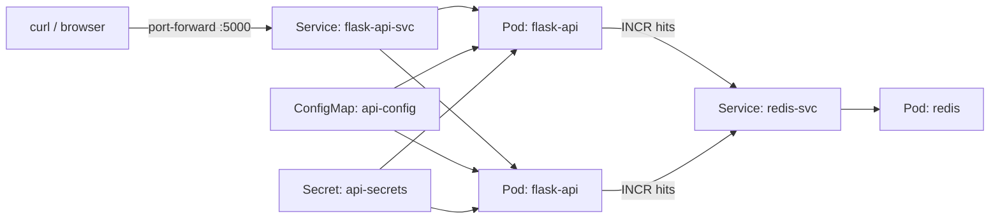

# Kubernetes Multiservice Staging Lab

[](https://github.com/AnouarMohamed/k8s-multiservice-lab/actions/workflows/ci.yaml)

A production-shaped Kubernetes lab that deploys a Flask API and Redis cache to
a real cluster using Docker, k3s, Kustomize, health probes, network policies,
autoscaling, resource controls, and CI validation.

The goal is not to run a toy YAML demo. This repo shows the full workflow a
DevOps engineer should be able to explain: build an app image, load it into a
local cluster, deploy multiple services, validate service discovery, control
traffic, observe rollouts, and keep everything reproducible from a clean clone.

## Stack

| Layer | Choice |
| --- | --- |
| Application | Flask API with Gunicorn |
| Cache | Redis |
| Container | Docker |
| Kubernetes | k3s, also works with kind for local checks |
| Manifests | Kustomize base + staging overlay |
| Validation | GitHub Actions, pytest, yamllint, kubeconform |

## Architecture



## What Makes It Strong

- Multi-service deployment: API service plus Redis backend.
- Declarative Kubernetes layout with reusable `base` and `staging` overlay.
- Real app behavior: Redis-backed request counter and JSON API responses.
- Health model: separate liveness `/healthz` and readiness `/readyz`.
- Runtime hardening: non-root containers, dropped capabilities, seccomp, and
  disabled service account token automounting.
- Traffic control: default-deny NetworkPolicies with explicit API-to-Redis flow.
- Staging controls: ResourceQuota, LimitRange, PodDisruptionBudget, and HPA.
- CI pipeline: unit tests, Docker build, YAML linting, Kustomize render, and
  Kubernetes schema validation.
- Operator workflow: every common task is available through `make`.

## Quick Start

Run from a privileged Linux dev environment, GitHub Codespaces, k3s, or an
active kind context:

```bash
make bootstrap
make build
make deploy
make smoke
make port-forward
```

Open:

```text
http://localhost:5000
```

Expected response:

```json
{
  "env": "staging",
  "hits": 1,
  "service": "flask-api",
  "status": "ok",
  "version": "1.0.0"
}
```

## API Endpoints

| Endpoint | Purpose |
| --- | --- |
| `/` | Increments Redis hit counter and returns app metadata |
| `/healthz` | Liveness probe endpoint |
| `/readyz` | Readiness probe endpoint that verifies Redis connectivity |
| `/metrics` | Minimal Prometheus-style hit counter metric |

## Common Commands

```bash
make validate      # tests, YAML lint, Kustomize render, schema validation
make build         # build flask-api:stg and load it into k3s/kind when possible
make deploy        # apply the staging overlay and wait for rollouts
make status        # inspect deployments, pods, services, HPA, PDB, policies
make logs          # show API logs
make restart       # rolling restart the API
make smoke         # verify API, readiness, Redis, and metrics through port-forward
make clean         # delete the staging namespace
```

## Repository Layout

```text
.
├── app/                    # Flask API, tests, Dockerfile
├── docs/                   # Architecture, runbook, security, troubleshooting
├── k8s/
│   ├── base/               # Reusable API and Redis resources
│   └── overlays/staging/   # Namespace, generated Secret, quota, limits
├── scripts/                # Bootstrap, build, deploy, validate, smoke test
├── .github/workflows/      # CI validation pipeline
└── Makefile                # Main operator entrypoint
```

## Documentation

- [Architecture](docs/architecture.md)
- [Runbook](docs/runbook.md)
- [Security](docs/security.md)
- [Troubleshooting](docs/troubleshooting.md)
- [Validation](docs/validation.md)

## GitHub About

Short description:

```text
Production-style Kubernetes multiservice lab with Flask, Redis, k3s, Kustomize, CI validation, network policies, probes, autoscaling, and runbooks.
```

Topics:

```text
kubernetes k3s flask redis docker kustomize devops cloud-native ci-cd sre networkpolicy
```
