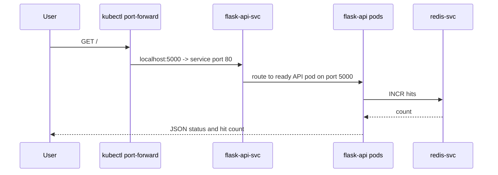

# Architecture

The lab deploys a small API platform into the `stg` namespace.

## Request Flow

## Kubernetes Resources

- `Deployment/flask-api`: two API replicas, rolling updates, liveness and
  readiness probes, non-root runtime, read-only filesystem, resource controls.
- `Deployment/redis`: single cache replica with TCP probes and ephemeral
  `emptyDir` storage for lab repeatability.
- `Service/flask-api-svc`: stable API endpoint.
- `Service/redis-svc`: stable Redis endpoint for the API.
- `ConfigMap/api-config`: environment and service discovery values.
- `Secret/api-secrets`: generated by Kustomize for lab-only secret injection.
- `HorizontalPodAutoscaler/flask-api`: CPU-based API scaling from two to five pods.
- `PodDisruptionBudget/flask-api`: keeps one API pod available during voluntary disruption.
- `NetworkPolicy/*`: default-deny traffic model with explicit DNS and API-to-Redis paths.

## Base and Overlay

`k8s/base` contains reusable application resources. `k8s/overlays/staging`
adds the `stg` namespace, environment values, generated Secret, quota, and
default container limits.

